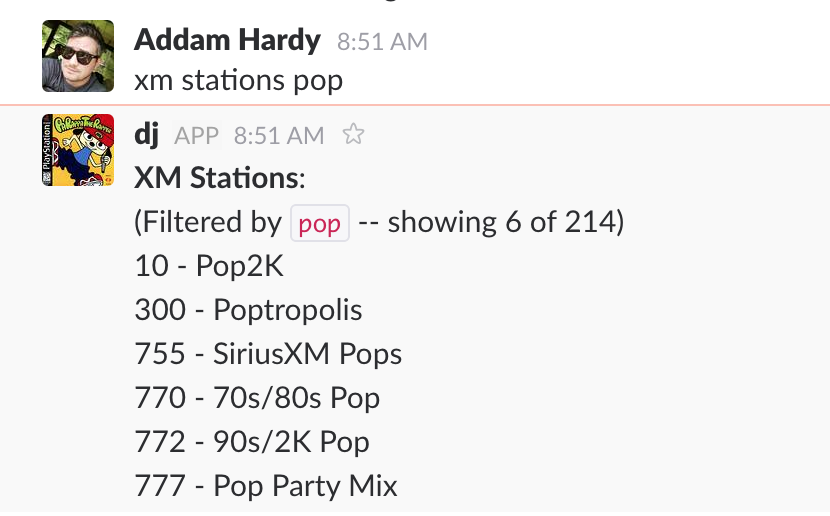
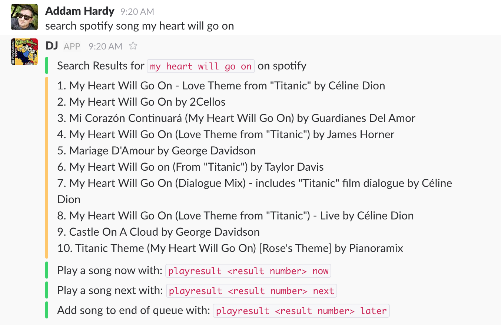
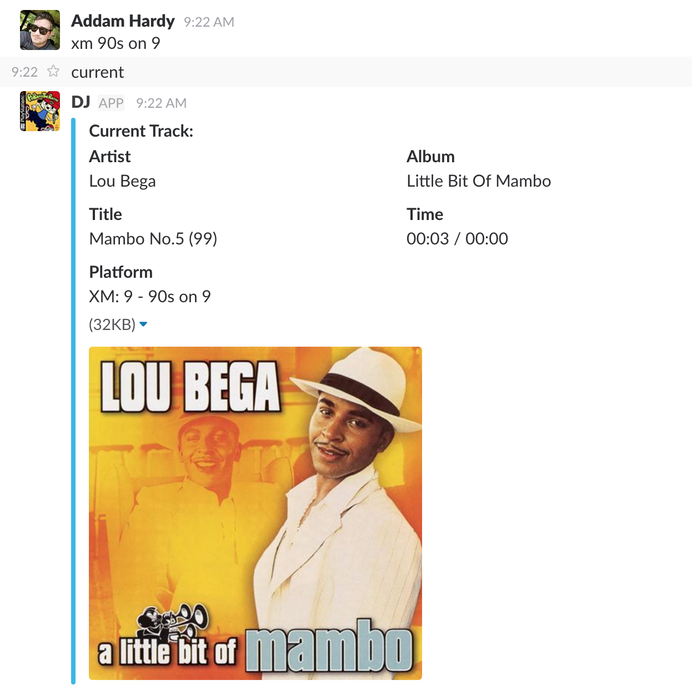
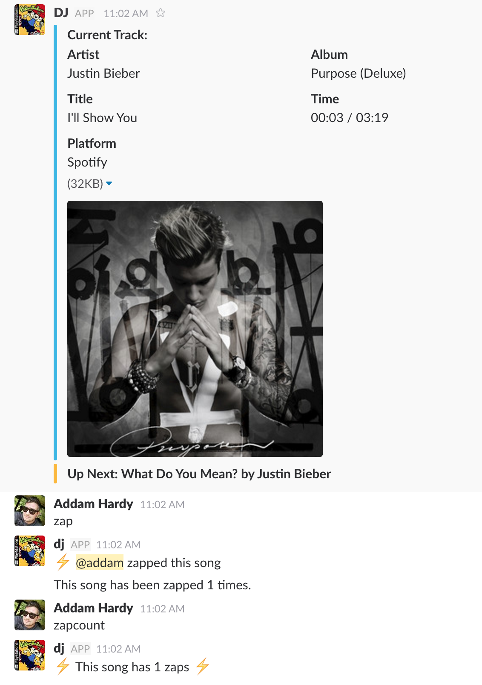
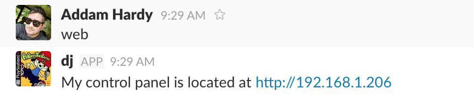
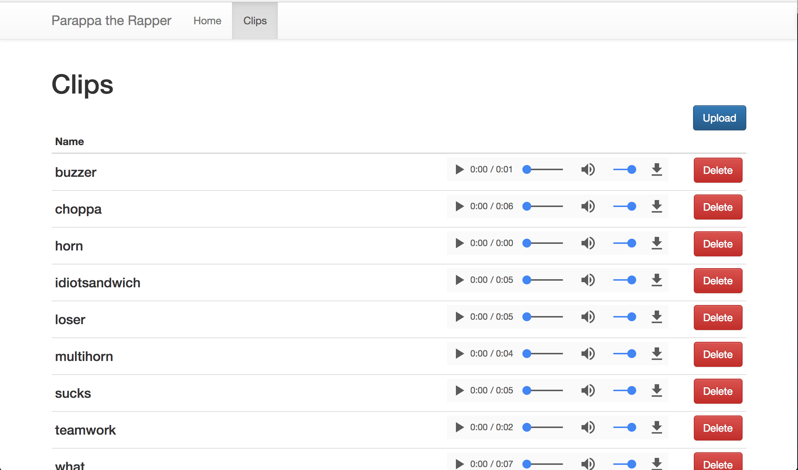

# PaRappa the Rapper: The Slack DJ


Let your team collaboratively manage the office Sonos playlist from Slack! [PaRappa](https://en.wikipedia.org/wiki/PaRappa_the_Rapper) will automatically detect and connect to any Sonos on the same network as the bot. At Lofty Labs we run PaRappa on a [Raspberry Pi](https://www.raspberrypi.org/) connected to our router.

## Features

* Programmable Slack interface for your Sonos Speaker (duh)
* List and filter XM radio stations

* Search for songs on Spotify and play or add to the queue

* Show song currently playing on Sonos in Slack

* Text to speech with Amazon Polly
* Song "voting" by allowing people in the Slack room to "zap" a song (down vote) while it's playing. If a song gets 3 zaps, the Sonos skips to the next song

* MP3 Soundboard backed by AWS S3. Play any mp3 on demand over the Sonos and it will switch back to the previously playing music automatically after the clip is over

* Web interface


* Component in web interface that allows easy management of mp3 files in S3 for the soundboard


## Requirements

* NodeJS
* Redis
* At least 1 Sonos Speaker
* Slack
* AWS account with an S3 bucket setup for the bot
* AWS account keys with access to Polly if you want to use Text-to-speech

## Configuration

`mv` `settings.json.example` to `settings.json` before starting the bot.

*Note: Don't commit this file to your git repo. Security, right?*

```
{
  "announceVolume": 50,
  "port": 3000,
  "aws": {
    "credentials": {
      "region": "us-east-2",
      "accessKeyId": "<AWS ACCESS KEY ID>",
      "secretAccessKey": "<AWS SECRET ACCESS KEY>"
    },
    "name": "Joanna"
  },
  "slack": {
    "token" : "<slack bot token>",
    "channel": "<channel you want PaRappa to listen in>"
  }
}
```

## Commands

```
PaRappa The DJ Help Menu
=======================
`clear` - Clear the current queue
`clearqueue` - Clear the queue.
`clip` - Play a clip from the soundboard
`listclips/clips` - List available soundboard clips
`current` - What's happening on the Jukebox right now?
`help` - Display list of available commands.
`list/ls/queue` - Show the current playlist.
`search <service> <type> <term>` - Search for a song.
`mute` - Mute the Sonos
`unmute` - Unmute the Sonos
`next` - Play the next song on the playlist.
`previous` - Play the previous song on the playlist.
`say` - Make Sonos say something
`timeseek` - Skip to specific time in song.
`trackseek` - Skip to specific song in queue.
`volume` - Display current volume
`setvolume` - Set current volume
`web` - Show the current web app URL
`xm stations` - List XM Station
`xm <station name>` - Play XM Station
`zap` - Zap the current song. Because it sucks.
`zapcount` - How many zaps does the current song have?
`clearzaps` - Clear active zaps
=======================
```
